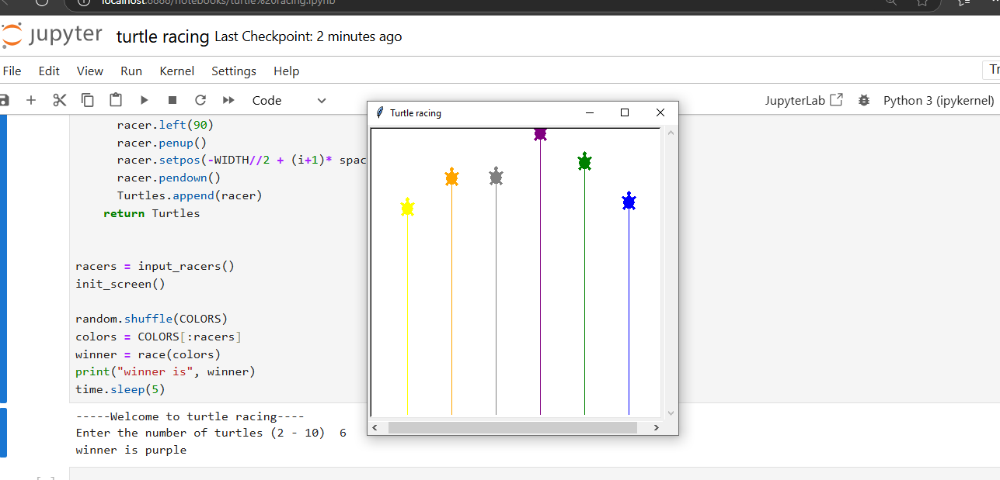

# Turtle Racing

Welcome to the Turtle Racing game! 🐢🏁

## Overview
This Python project creates a simple turtle racing game using the Turtle graphics library. Players can set the number of turtles, and the game will simulate a race with the turtles moving randomly.

## Features
- Configurable number of turtles (2-10)
- Randomized movement for each turtle
- Visual race simulation

## How to Run
Follow the steps below to run the Turtle Racing game in Jupyter Notebook:  

### 1. Open Jupyter Notebook  
1. Open **Command Prompt (CMD)**.  
2. Start Jupyter Notebook by running:  
   ```sh
   jupyter notebook
This will launch Jupyter Notebook in your web browser.
### 2. Create a New Notebook
- In Jupyter Notebook, navigate to the top-right corner and click New → Python 3 to create a new notebook.
### 3. Copy and Paste the Code
- Open the .py or .ipynb file from this repository.
- Copy the entire code and paste it into the first cell of your new Jupyter Notebook.
### 4. Execute the Code
- Click inside the cell and press Shift + Enter to run the code.
- When prompted, enter the number of turtles for the race and press Enter.
### 5. Watch the Race
- A new window will open (it may be minimized).
- If minimized, restore it to view the race in progress. 
- Below is a preview of the race screen:  


### 6. View the Results
- Once the race is complete, the winning turtle’s name will be displayed in the Jupyter Notebook.   

## Dependencies
- `turtle` (Python standard library)

